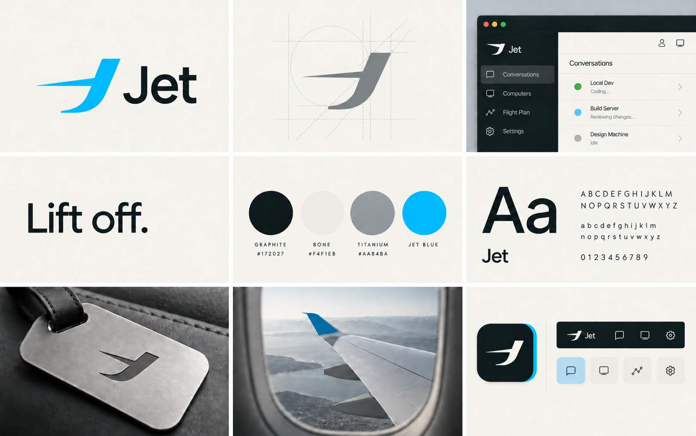

# Jet brand

The approved identity is the **Wing J** with the `Jet` wordmark. Its swept leading edge suggests a private jet in motion; the curved descent gives the mark a clear J silhouette. Use this one shape across print, web, and apps. The campaign line is **Lift off.**

## Files

| Use | Master | Ready to use |
| --- | --- | --- |
| Primary logo, blue mark and graphite wordmark | [SVG](jet-logo.svg) | [PNG](jet-logo.png) |
| Logo on dark surfaces, blue mark and bone wordmark | [SVG](jet-logo-on-dark.svg) | [PNG](jet-logo-on-dark.png) |
| Single-color logo | [SVG](jet-logo-mono.svg) | [PNG](jet-logo-mono.png) |
| Wing J symbol | [SVG](jet-mark.svg) | [PNG](jet-mark.png) |
| Flat app icon, 1024 px | [SVG](jet-app-icon.svg) | [PNG](jet-app-icon.png) |
| macOS and iOS Liquid Glass icon | [Icon Composer document](../../apps/jet/jet/AppIcon.icon) | [Static preview](jet-apple-icon-preview.png) |

The wordmark is outlined in the SVGs, so it renders without a font installation. The mark path is identical in the logo, flat icon, and [Apple foreground layer](apple/jet-mark-layer.svg). The Apple icon keeps that shape and lets the system render its Liquid Glass material. Do not bake a glass highlight into the flat assets.

## Color and use

| Role | Hex |
| --- | --- |
| Jet blue, signature accent | `#29B6F6` |
| Graphite, primary ink | `#172027` |
| Bone, light canvas | `#F4F1EB` |
| Titanium, secondary detail | `#AAB4BA` |

Use the primary logo on light backgrounds and the dark-surface logo on graphite or other dark backgrounds. Keep the mark's proportions, angle, and generous clear space. The blue is an accent against restrained materials and typography, not a full-page fill. The board's interface and physical applications illustrate the visual language; product terminology follows Jet's domain documentation.
